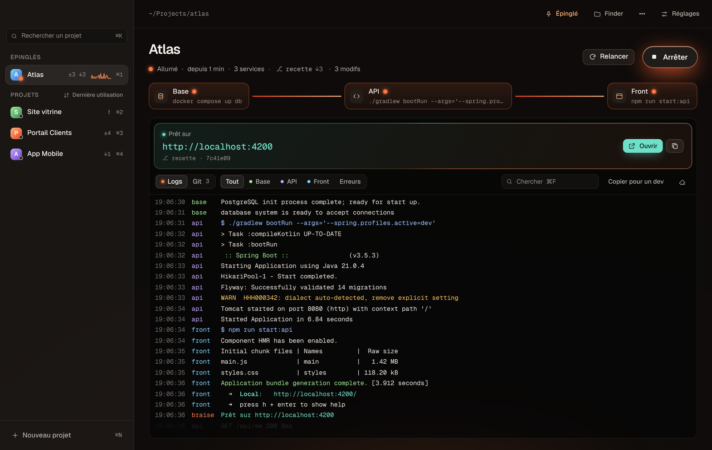
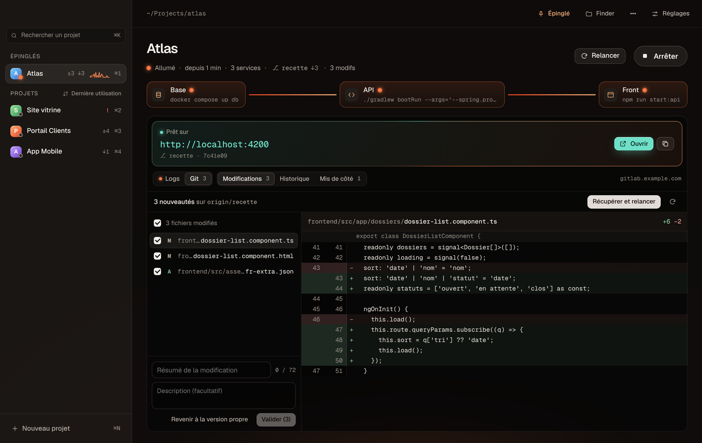

# Braise

**Tes projets, allumés.** Braise lance tes projets locaux d'un clic, montre leurs logs en direct et ouvre le navigateur dès qu'ils sont prêts. Pour les devs, les PO et les designers, sans ouvrir un seul terminal.



## Installation

Ouvre le Terminal et colle cette commande :

```sh
curl -fsSL https://raw.githubusercontent.com/TomRetouret/braise-releases/main/install.sh | sh
```

C'est tout. Braise s'installe dans `~/Applications`, s'ouvre, puis **se met à jour tout seul** : une pastille « Installer » apparaît en bas de la liste quand une nouvelle version sort.

Le script :

1. lit la dernière version publiée ici ;
2. télécharge l'app, universelle Apple Silicon et Intel ;
3. vérifie son empreinte SHA-256 et sa signature ;
4. l'installe dans ton dossier personnel, sans mot de passe administrateur.

Pour installer une version précise :

```sh
curl -fsSL https://raw.githubusercontent.com/TomRetouret/braise-releases/main/install.sh | BRAISE_VERSION=v0.4.1 sh
```

**Configuration requise** : macOS 12 ou plus récent. Braise ne remplace pas tes outils : il lance ce que tes projets utilisent déjà (Docker ou OrbStack, Node, Java…). Pour l'onglet Git, il te faut Git et un accès déjà configuré à tes dépôts (clé SSH ou trousseau).

## Bien démarrer

1. **Ajoute un projet** : glisse son dossier sur la fenêtre, ou ⌘N. Pour en ajouter plusieurs d'un coup, choisis « importer tout un dossier » et indique par exemple `~/Projects`.
2. **Vérifie la proposition** : Braise lit le projet (docker compose, Gradle, Maven, npm, pnpm, yarn, Makefile…), trouve les services et recommande la bonne commande pour chacun.
3. **Lance** : la base, puis l'API, puis le front, chacun attendant que le précédent soit prêt. L'adresse à ouvrir s'affiche dès que tout est prêt.

## Ce que Braise sait faire

- **Plusieurs services, dans le bon ordre** : base, API et front démarrent l'un après l'autre. Un clic arrête tout proprement, conteneurs et ports compris.
- **Ton environnement, sans configuration** : les commandes tournent dans ton shell, avec nvm, sdkman et Homebrew. `nvm use` est automatique si le projet a un `.nvmrc`.
- **Prérequis vérifiés avant de lancer**, avec un bouton pour corriger :
  - Docker éteint : « Démarrer OrbStack » ;
  - dépendances manquantes : « Installer » ;
  - `.env` absent : « Copier .env.example » ;
  - Java trop récent pour Gradle : « Utiliser Java 21 ».
- **Logs lisibles** : couleurs, filtre par service ou par erreurs, recherche, et « Copier pour un dev » pour demander de l'aide sur Slack.
- **Port déjà pris** : Braise dit qui l'occupe et propose de l'arrêter ou de prendre un autre port.
- **Git intégré** :
  - changer de branche et relancer d'un geste ;
  - récupérer les nouveautés, voir les modifications, valider, pousser ;
  - ouvrir la merge request.

  Tes modifications ne sont jamais perdues : elles vont dans « Mis de côté ».
- **Recette partagée** : coche « Enregistrer la configuration dans le dépôt du projet » et commite le fichier `.braise.json`. Tes collègues n'auront rien à configurer. Le fichier ne contient ni secret ni chemin propre à ton Mac.
- **Barre de menus** : tes projets allumés et les 6 derniers lancés, à démarrer sans ouvrir la fenêtre. Fermer la fenêtre peut laisser tourner les projets.
- **Notifications** : « prêt » et « arrêté sur erreur », quand Braise est en arrière-plan.



## Raccourcis

| Raccourci | Action |
| --- | --- |
| ⌘N | Nouveau projet |
| ⌘P | Palette : toutes les actions au clavier |
| ⌘K | Chercher un projet |
| ⌘R | Lancer ou relancer |
| ⌘. | Arrêter |
| ⌘O | Ouvrir dans le navigateur |
| ⌘B | Changer de branche |
| ⌘F | Chercher dans les logs |
| ⌘L et ⌘G | Onglets Logs et Git |
| ⌘, | Réglages du projet |
| ⌘1 à ⌘9 | Aller au projet n |

## Questions fréquentes

**macOS dit que l'app est endommagée ou ne peut pas être ouverte.**
Cela arrive si l'app a été téléchargée avec un navigateur au lieu de la commande d'installation. Relance simplement la commande `curl` ci-dessus. Braise n'est pas notarisé par Apple : la commande d'installation est la façon prévue de l'installer.

**Un outil est « introuvable » alors qu'il marche dans mon terminal.**
Clique sur « Revérifier ». Si le message persiste, vérifie que l'outil est bien chargé par ton `~/.zshrc` ou `~/.zprofile`, car Braise utilise le même shell que toi.

**Le projet démarre mais Braise reste sur « Démarrage… ».**
Braise attend un signal « prêt » dans les logs ou l'ouverture du port. Indique le port attendu dans les réglages du service.

**Où sont mes données ?**
Uniquement sur ton Mac, dans `~/Library/Application Support/fr.quatresh.braise`. Braise n'envoie rien et ne stocke aucun identifiant.

## Désinstaller

Glisse `~/Applications/Braise.app` dans la corbeille. Pour effacer aussi la liste de tes projets, supprime le dossier `~/Library/Application Support/fr.quatresh.braise`.

## Versions

Toutes les versions et leurs notes sont dans [Releases](https://github.com/TomRetouret/braise-releases/releases). Une idée, un souci ? Écris à Tom.
