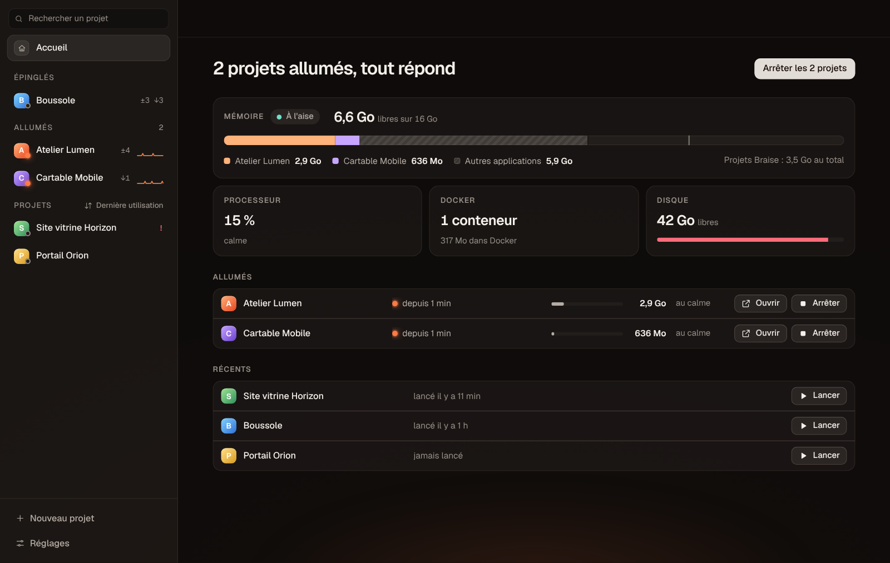
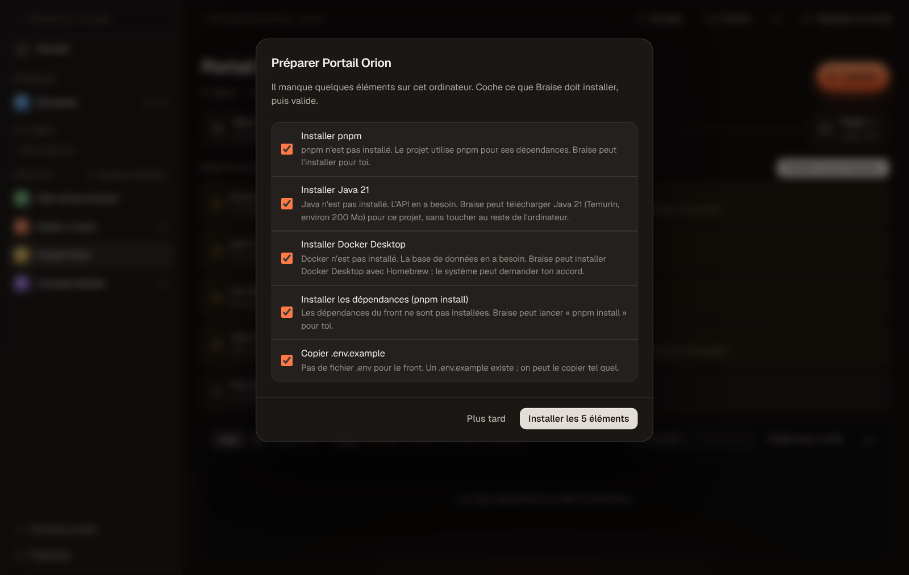
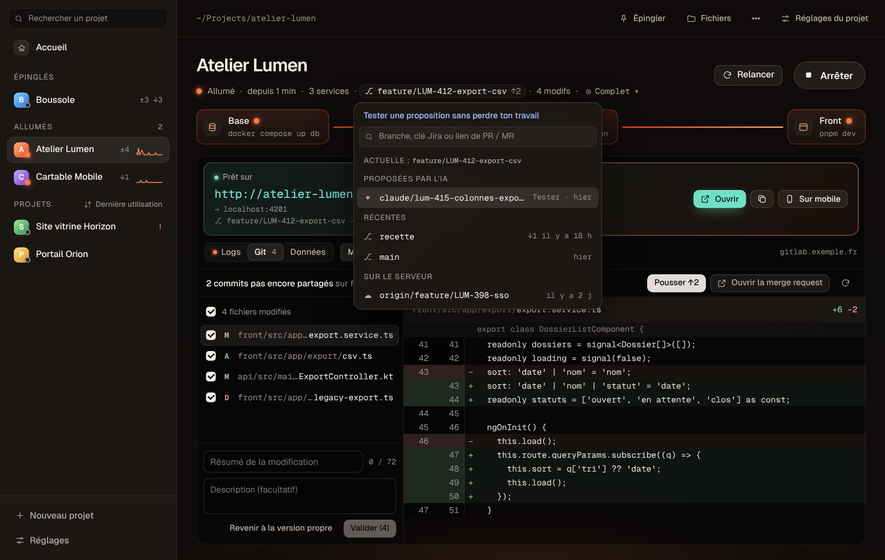
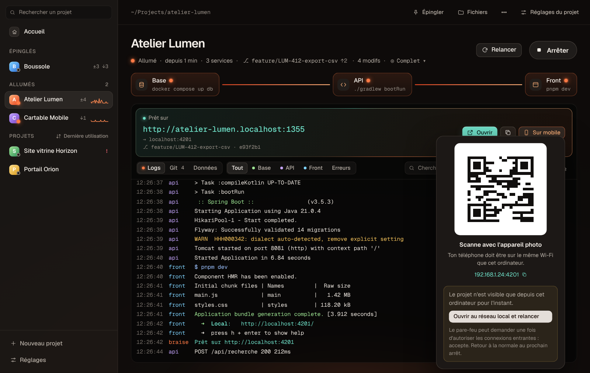
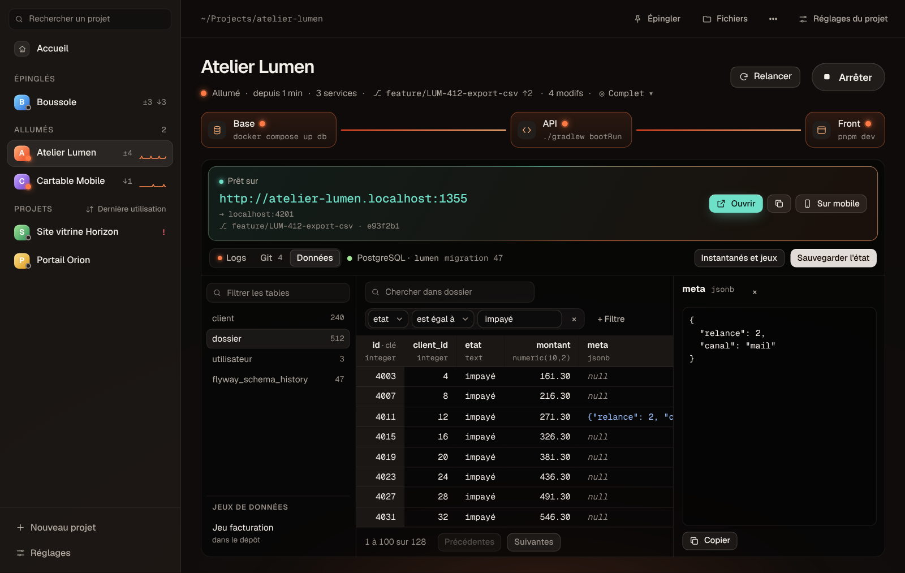
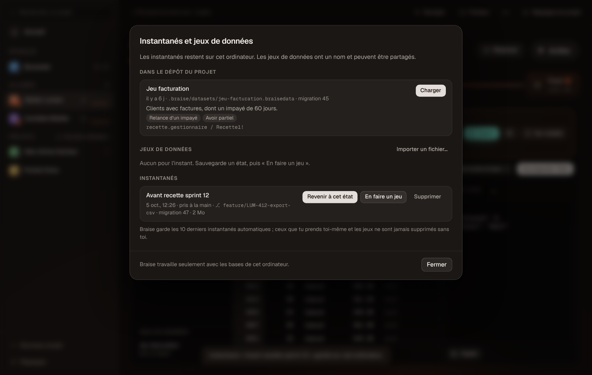

# Braise

**Tes projets, allumés.** Braise lance tes projets locaux d'un clic, montre leurs logs en direct et ouvre le navigateur dès qu'ils sont prêts. Pour les devs, les PO et les designers, sans ouvrir un seul terminal. Sur Mac, Windows et Linux.



## Installation

Braise existe pour **Mac**, **Windows** et **Linux**. Une commande suffit, puis Braise **se met à jour tout seul** : une pastille « Installer » apparaît en bas de la liste quand une nouvelle version sort.

### Mac

Ouvre le Terminal et colle :

```sh
curl -fsSL https://raw.githubusercontent.com/TomRetouret/braise-releases/main/install.sh | sh
```

Braise s'installe dans `~/Applications` (app universelle Apple Silicon et Intel), puis s'ouvre. macOS 12 ou plus récent.

### Windows (bêta)

Ouvre PowerShell (menu Démarrer, tape « PowerShell ») et colle :

```powershell
irm https://raw.githubusercontent.com/TomRetouret/braise-releases/main/install.ps1 | iex
```

Braise s'installe pour ton compte, sans droit administrateur, puis s'ouvre. Windows 10 ou 11, 64 bits. Il apparaît ensuite dans le menu Démarrer.

### Linux

Ouvre un terminal et colle la même commande que sur Mac :

```sh
curl -fsSL https://raw.githubusercontent.com/TomRetouret/braise-releases/main/install.sh | sh
```

Braise s'installe dans `~/.local/share/braise` (AppImage), avec une entrée dans le menu des applications et la commande `braise`. Testé sur Ubuntu 22.04 et 24.04, processeurs x86_64. Le paquet `.deb` est aussi dans [Releases](https://github.com/TomRetouret/braise-releases/releases), mais seule l'AppImage se met à jour toute seule.

### Ce que fait la commande

1. Elle lit la dernière version publiée ici.
2. Elle télécharge Braise pour ton système et vérifie son empreinte SHA-256 (et sa signature sur Mac).
3. Elle l'installe dans ton dossier personnel, sans mot de passe administrateur.

Pour installer une version précise, sur Mac ou Linux :

```sh
curl -fsSL https://raw.githubusercontent.com/TomRetouret/braise-releases/main/install.sh | BRAISE_VERSION=v0.6.0 sh
```

Sur Windows : `$env:BRAISE_VERSION = "v0.6.0"` avant la commande.

**Ce qu'il te faut** : Braise lance ce que tes projets utilisent (Docker Desktop ou OrbStack, Node, Java…) et propose d'installer ce qui manque. Pour l'onglet Git, il te faut Git et un accès déjà configuré à tes dépôts (clé SSH, trousseau ou gestionnaire d'identifiants Git).

## Bien démarrer

1. **Ajoute un projet** : glisse son dossier sur la fenêtre, ou ⌘N. Le projet n'est pas encore sur ton ordinateur ? Onglet « Depuis Git » : colle le lien du dépôt (GitHub, GitLab…) ou connecte-toi à GitHub pour le choisir dans la liste, Braise le télécharge. Pour en ajouter plusieurs d'un coup, choisis « importer tout un dossier » et indique par exemple `~/Projects`.
2. **Vérifie la proposition** : Braise lit le projet (docker compose, Gradle, Maven, npm, pnpm, yarn, Makefile…), trouve les services et recommande la bonne commande pour chacun.
3. **Lance** : la base, puis l'API, puis le front, chacun attendant que le précédent soit prêt. L'adresse à ouvrir s'affiche dès que tout est prêt.

## Ce que Braise sait faire

### Démarrer un projet sans connaître le projet

- **Projets depuis Git** : colle le lien d'un dépôt GitHub ou GitLab, ou connecte-toi à GitHub et choisis dans la liste. Braise télécharge le projet, trouve comment le lancer et propose d'installer ce qui manque.
- **Ce qui manque s'installe en un clic** : juste après l'ajout d'un projet, une fenêtre liste ce qu'il faut (Node, pnpm ou yarn, Java, Docker Desktop, dépendances, `.env`). Coche, valide, suis la barre de progression : le projet démarre à la fin. Java est téléchargé pour le projet seulement, sans toucher au reste de l'ordinateur. Docker éteint : « Démarrer OrbStack » ; Java trop récent pour Gradle : « Utiliser Java 21 ». Une commande manque au lancement (`mvn`…) : Braise propose aussi de l'installer.
- **Plusieurs services, dans le bon ordre** : base, API et front démarrent l'un après l'autre. Un clic arrête tout proprement, conteneurs et ports compris.
- **Ton environnement, sans configuration** : les commandes tournent dans ton shell, avec nvm, sdkman et Homebrew. `nvm use` est automatique si le projet a un `.nvmrc`.
- **Port déjà pris** : Braise prend un autre port libre tout seul quand le projet le propose, sinon il dit qui occupe le port et propose de l'arrêter.



### Suivre ce qui tourne

- **Accueil** (⌘0) : ce qui tourne, ce que ça coûte à ton ordinateur (mémoire par projet, processeur, Docker, disque) et l'action utile, comme arrêter les projets oubliés ou tous les projets d'un coup.
- **Adresses fixes** : chaque projet a sa propre adresse, `http://monprojet.localhost:1355`, qui ne change pas quand le port change. Un service précis : `api.monprojet.localhost:1355`.
- **Logs lisibles** : couleurs, filtre par service ou par erreurs, recherche, et « Copier pour un dev » pour demander de l'aide sur Slack.
- **Barre de menus** (zone de notification sur Windows et Linux) : tes projets allumés et les 6 derniers lancés, à démarrer sans ouvrir la fenêtre. Fermer la fenêtre peut laisser tourner les projets.
- **Notifications et sons** : notification « prêt » et « arrêté sur erreur » ; trois sons distincts (démarrage, erreur, arrêt), chacun activable séparément, volume réglable.


### Recetter une évolution

- **Tester ce que l'IA propose** : les branches poussées par Claude, Codex ou Cursor apparaissent dans « Proposées par l'IA » (⌘T). Tu peux aussi coller le lien d'une pull request ou d'une merge request. Un clic pour tester, un clic pour « Revenir où j'étais » : ton travail en cours est mis de côté puis rendu.
- **Git intégré** :
  - changer de branche et relancer d'un geste ;
  - récupérer les nouveautés, voir les modifications, valider, pousser ;
  - ouvrir la merge request.

  Tes modifications ne sont jamais perdues : elles vont dans « Mis de côté ».
- **Ticket Jira** : la clé du ticket (PRJ-412) est repérée dans le nom de la branche et s'ouvre en un clic.
- **Tester sur téléphone** : « Sur mobile » affiche un QR code. Ton téléphone doit être sur le même Wi-Fi que l'ordinateur.






### Préparer les données de recette

- **Onglet « Données »** : les tables de la base du projet, en lecture seule, avec le nombre de lignes, une recherche dans toutes les colonnes, des filtres par colonne et le détail d'une ligne à copier. La base du projet est éteinte ? « Démarrer la base seule ».
- **Instantanés** : « Sauvegarder l'état » garde une copie de la base, « Remplacer les données » y revient en un clic. Braise garde aussi un instantané de sécurité avant chaque retour, et en prend un tout seul avant de tester une branche.
- **Jeux de données** : un état devient un jeu nommé, avec sa description, les cas couverts et les comptes de test. Exporte-le en fichier `.braisedata`, importe celui d'un collègue, ou partage-le dans le dépôt (`.braise/datasets/`) pour que toute l'équipe le charge en un clic.
- **Sans risque** : Braise ne touche qu'aux bases de ton ordinateur (le `docker compose` du projet). Il lit les identifiants dans le projet à chaque fois et ne les enregistre nulle part. Un jeu venu d'une version plus récente du code n'est pas chargé.





### Partager et personnaliser

- **Recette partagée** : coche « Enregistrer la configuration dans le dépôt du projet » et commite le fichier `.braise.json`. Tes collègues n'auront rien à configurer. Le fichier ne contient ni secret ni chemin propre à ton ordinateur. Avant d'exécuter des commandes venues du fichier d'un collègue, Braise te les montre et te demande « Faire confiance ».
- **Actions rapides** : « Réinitialiser la base », « Charger les données de démo », « Lancer les tests »… Braise les propose d'après les scripts du projet, tu les lances depuis le menu ••• ou ⌘P.
- **Profils de lancement** : « Front seul », « Démo client »… seulement certains services, ou d'autres réglages.
- **Thème clair ou sombre**, ou comme le système (Réglages, Apparence).
- **Réglages de Braise** (bouton en bas de la liste, ou ⌘,) : valeurs par défaut des nouveaux projets, sons et notifications, fermeture de la fenêtre, compte GitHub, liste des raccourcis clavier, mises à jour.

## Raccourcis

Sur Windows et Linux, remplace ⌘ par Ctrl.

| Raccourci | Action |
| --- | --- |
| ⌘N | Nouveau projet |
| ⌘0 | Accueil |
| ⌘P | Palette : toutes les actions au clavier |
| ⌘K | Chercher un projet |
| ⌘R | Lancer ou relancer |
| ⌘. | Arrêter |
| ⌘O | Ouvrir dans le navigateur |
| ⌘B | Changer de branche |
| ⌘T | Tester une proposition (branche de l'IA, PR, MR) |
| ⌘F | Chercher dans les logs |
| ⌘L et ⌘G | Onglets Logs et Git |
| ⌘, | Réglages de Braise |
| ⌘I | Réglages du projet |
| ⌘1 à ⌘9 | Aller au projet n |

## Questions fréquentes

**Windows affiche « Windows a protégé votre ordinateur ».**
Cela arrive si l'installateur a été téléchargé avec un navigateur : Braise n'est pas encore signé par un éditeur reconnu. Clique sur « Informations complémentaires », puis « Exécuter quand même », ou installe plutôt avec la commande PowerShell ci-dessus.

**Sur Windows, une commande ne se comporte pas comme dans mon terminal.**
Braise lance les commandes avec l'invite de commandes Windows (cmd). Une commande prévue pour bash (avec `export`, `&&` sur d'anciens outils ou des chemins `./script.sh`) peut demander une version Windows : indique-la dans les réglages du service. `nvm use` automatique n'existe pas sur Windows.

**macOS dit que l'app est endommagée ou ne peut pas être ouverte.**
Cela arrive si l'app a été téléchargée avec un navigateur au lieu de la commande d'installation. Relance simplement la commande `curl` ci-dessus. Braise n'est pas notarisé par Apple : la commande d'installation est la façon prévue de l'installer.

**Un outil est « introuvable » alors qu'il marche dans mon terminal.**
Clique sur « Revérifier ». Si le message persiste, vérifie que l'outil est bien chargé par ton `~/.zshrc` ou `~/.zprofile`, car Braise utilise le même shell que toi.

**Le projet démarre mais Braise reste sur « Démarrage… ».**
Braise attend un signal « prêt » dans les logs ou l'ouverture du port. Indique le port attendu dans les réglages du service.

**Où sont mes données ?**
Uniquement sur ton ordinateur : `~/Library/Application Support/fr.quatresh.braise` sur Mac, `%APPDATA%\fr.quatresh.braise` sur Windows, `~/.local/share/fr.quatresh.braise` sur Linux. Braise n'envoie rien et ne stocke aucun identifiant.

## Désinstaller

- **Mac** : glisse `~/Applications/Braise.app` dans la corbeille.
- **Windows** : Paramètres, Applications, Braise, Désinstaller.
- **Linux** : `curl -fsSL https://raw.githubusercontent.com/TomRetouret/braise-releases/main/install.sh | BRAISE_UNINSTALL=1 sh`

Pour effacer aussi la liste de tes projets, supprime le dossier de données indiqué plus haut.

## Versions

Toutes les versions et leurs notes sont dans [Releases](https://github.com/TomRetouret/braise-releases/releases). Une idée, un souci ? Écris à Tom.
